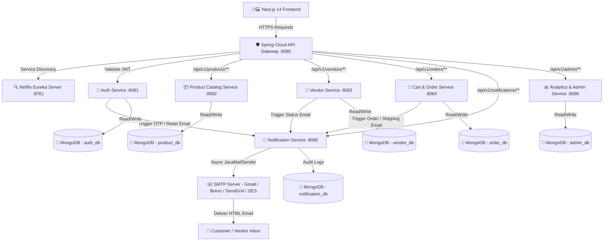
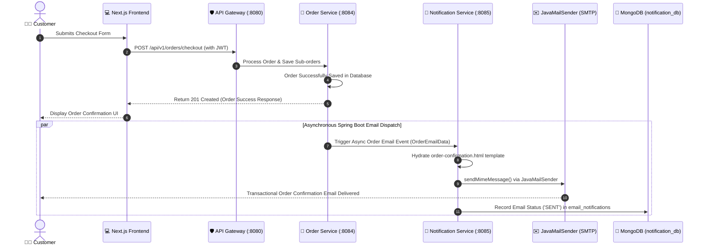

# MarketGrid: Multi-Vendor E-Commerce Platform Architecture

## 📌 Architecture Overview

MarketGrid is an enterprise-grade, scalable **Multi-Vendor E-Commerce Platform**. The system is built with a **Next.js 14 (App Router)** frontend and a **Spring Boot Microservices Architecture** backend, powered by **MongoDB** for document storage, **Spring Cloud API Gateway** for routing, **Netflix Eureka** for dynamic service discovery, and **Spring Boot Mail (`spring-boot-starter-mail` + `JavaMailSender` + SMTP)** for transactional notifications.

> [!IMPORTANT]
> **Backend Architecture Constraint**: The entire MarketGrid notification ecosystem operates strictly within **Spring Boot + Spring Boot Starter Mail + JavaMailSender + SMTP**. No Node.js / Nodemailer components are used in the architecture.



---

## 🔐 Logins & Authentication Architecture (`Logins & Roles`)

The system enforces strict **Role-Based Access Control (RBAC)** supporting 3 primary user personas:

### 1. 👨‍💼 Customer (`ROLE_CUSTOMER`)
* **Purpose**: Storefront shoppers who browse products, manage cart/wishlist, place orders, receive order confirmation emails, and track shipping.
* **Authentication Endpoint**: `POST /api/v1/auth/login` (Returns JWT token with claim `role: ROLE_CUSTOMER`).
* **Access Level**: Public storefront, customer portal (`/customer/*`), order history, personal profile.

### 2. 🏪 Vendor / Seller (`ROLE_VENDOR`)
* **Purpose**: Independent merchants who register their business, undergo KYC verification, upload products, process sub-orders, and receive vendor approval/rejection emails.
* **Authentication Endpoint**: `POST /api/v1/auth/login` or Vendor Portal login (`/vendor/login`).
* **Onboarding & KYC Logic**:
  * Vendor submits business info (GSTIN, PAN, Bank Details).
  * Status defaults to `PENDING` until approved by Admin.
  * System dispatches `vendor-approved.html` or `vendor-rejected.html` via Spring Boot Mail upon status change.

### 3. 🛡️ Admin / Superuser (`ROLE_ADMIN`)
* **Purpose**: Marketplace platform owners who approve/reject vendors, moderate product listings, manage category schemas, inspect transactions, and monitor platform metrics.
* **Authentication Endpoint**: Admin Portal login (`/admin/login`).
* **Access Level**: Full administrative access (`/admin/*`), security logs, vendor KYC governance.

---

## ✉️ Spring Boot Email & Notification Specification

The notification engine is built directly inside the Spring Boot backend using `spring-boot-starter-mail` and `JavaMailSender`.

### 1. 🏗️ Architecture & Component Responsibilities
```text
[ Auth / Order / Vendor Service ]
               │
               ▼ (DTO Payload)
     [ NotificationService ]
               │
               ▼ (@Async Execution)
     [ EmailTemplateService ] ──> Hydrates HTML Templates
               │
               ▼
     [ JavaMailSender ] ──> Sends via Provider SMTP
               │
               ▼
 [ MongoDB: email_notifications ] (Audit Trail)
```

### 2. 📧 Transactional Email Types & Templates
All emails are rendered using rich, responsive HTML templates located at `src/main/resources/templates/email/`:

| Email Type | Trigger Event | Template File | Key Security & Content Constraints |
|---|---|---|---|
| **OTP Verification** | Registration / Auth | `otp.html` | 6-digit OTP code, expiration time, security warning. **OTP is never logged or stored in plain text**. |
| **Email Verification** | Account Activation | `email-verification.html` | Verification URL with secure one-time token. |
| **Password Reset** | Forgot Password request | `password-reset.html` | HTTPS single-use reset URL. **Existing passwords are never sent**. |
| **Order Confirmation** | Order placement | `order-confirmation.html` | Order number, items grouped by vendor, sub-totals, delivery address. |
| **Order Shipped** | Vendor updates status to `SHIPPED` | `order-shipped.html` | Sub-order ID, vendor name, tracking number, carrier link. |
| **Order Delivered** | Package delivered | `order-delivered.html` | Delivery timestamp, support & feedback CTA. |
| **Vendor Approved** | Admin approves KYC | `vendor-approved.html` | Account activation link, vendor dashboard onboarding CTA. |
| **Vendor Rejected** | Admin rejects KYC | `vendor-rejected.html` | Reason for rejection, resubmission instructions. |
| **Vendor Suspended** | Admin suspends seller | `vendor-suspended.html` | Policy violation details, appeal desk email. |

### 3. ⚙️ Provider-Independent SMTP Configuration
Spring Boot Mail is configured via environment variables and supports any standard SMTP provider (Gmail, Brevo, SendGrid, Mailgun, Amazon SES):

```yaml
# application.yml / application.properties
spring:
  mail:
    host: ${MAIL_HOST}
    port: ${MAIL_PORT}
    username: ${MAIL_USERNAME}
    password: ${MAIL_PASSWORD}
    protocol: ${MAIL_PROTOCOL:smtp}
    properties:
      mail:
        smtp:
          auth: true
          starttls:
            enable: true
            required: true
          connectiontimeout: 5000
          timeout: 5000
          writetimeout: 5000

marketgrid:
  mail:
    from: ${MAIL_FROM:noreply@marketgrid.io}
    from-name: ${MAIL_FROM_NAME:MarketGrid Marketplace}
```

#### `.env.example` Template
```env
# Spring Boot SMTP Email Credentials
MAIL_HOST=smtp.sendgrid.net
MAIL_PORT=587
MAIL_USERNAME=apikey
MAIL_PASSWORD=SG.your_secure_api_key_here
MAIL_FROM=noreply@marketgrid.io
MAIL_FROM_NAME=MarketGrid Support
MAIL_PROTOCOL=smtp
```

### 4. ⚡ Non-Blocking Asynchronous Processing (`@Async`) & Resiliency
* **Asynchronous Execution**: Email dispatches are annotated with `@Async` so that API endpoints (e.g., checkout) return immediately without waiting for SMTP responses.
* **Failure Isolation**: If an SMTP server experiences downtime, the master order remains saved successfully. The failure is recorded in MongoDB and scheduled for exponential backoff retry.
* **Idempotency Protection**: Duplicate-sensitive emails use unique keys (e.g., `ORDER_CONFIRMATION:{orderId}`) to prevent duplicate customer emails.

---

## 🍃 MongoDB Key Storage Schemas (`Database Schemas`)

### 1. `users` Collection (`auth-service`)
```json
{
  "_id": "ObjectId('6501a2b3c4d5e6f7a8b9c001')",
  "name": "Rahul Verma",
  "email": "rahul.customer@example.com",
  "passwordHash": "$2a$12$eImiTXuWVxfM37uY4JANjO...",
  "role": "ROLE_CUSTOMER",
  "phone": "+919876543210",
  "isEmailVerified": true,
  "createdAt": "2026-09-20T10:00:00Z"
}
```

### 2. `vendors` Collection (`vendor-service`)
```json
{
  "_id": "ObjectId('6501a2b3c4d5e6f7a8b9c002')",
  "name": "Apex Electronics Store",
  "slug": "apex-electronics",
  "ownerName": "Suresh Patel",
  "ownerEmail": "suresh@apexelectronics.com",
  "phone": "+919812345678",
  "businessType": "Private Limited",
  "gstin": "27AAACA12341ZV",
  "panNumber": "ABCDE1234F",
  "bankName": "HDFC Bank",
  "accountNumber": "50100234567890",
  "ifscCode": "HDFC0001234",
  "status": "ACTIVE",
  "rating": 4.8,
  "totalProducts": 42,
  "totalOrders": 128,
  "joinedDate": "2026-01-15"
}
```

### 3. `products` Collection (`product-catalog-service`)
```json
{
  "_id": "ObjectId('6501a2b3c4d5e6f7a8b9c003')",
  "name": "Wireless Noise-Canceling Headphones",
  "slug": "wireless-noise-canceling-headphones",
  "vendorId": "6501a2b3c4d5e6f7a8b9c002",
  "vendorName": "Apex Electronics Store",
  "categoryId": "6501a2b3c4d5e6f7a8b9c010",
  "categoryName": "Electronics",
  "subcategory": "Audio & Headphones",
  "price": 4999.00,
  "originalPrice": 6999.00,
  "discountPercentage": 28,
  "stock": 150,
  "sku": "APEX-AUDIO-001",
  "status": "Active",
  "variants": [
    { "id": "v1", "name": "Color: Midnight Black", "options": ["Black"], "priceOffset": 0 },
    { "id": "v2", "name": "Color: Platinum Silver", "options": ["Silver"], "priceOffset": 200 }
  ]
}
```

### 4. `orders` Collection (`cart-order-service`)
```json
{
  "_id": "ObjectId('6501a2b3c4d5e6f7a8b9c004')",
  "customerName": "Rahul Verma",
  "customerEmail": "rahul.customer@example.com",
  "shippingAddress": {
    "fullName": "Rahul Verma",
    "street": "123 MG Road, Suite 4B",
    "city": "Bengaluru",
    "state": "Karnataka",
    "zipCode": "560001",
    "phone": "+919876543210"
  },
  "subOrders": [
    {
      "vendorId": "6501a2b3c4d5e6f7a8b9c002",
      "vendorName": "Apex Electronics Store",
      "subtotal": 4999.00,
      "status": "Confirmed",
      "trackingNumber": "TRK-APEX-98214",
      "estimatedDelivery": "2026-09-24",
      "items": [
        {
          "product": { "id": "6501a2b3c4d5e6f7a8b9c003", "name": "Wireless Noise-Canceling Headphones", "price": 4999.00 },
          "quantity": 1,
          "selectedVariant": "Midnight Black"
        }
      ]
    }
  ],
  "grandTotal": 5049.00,
  "deliveryFee": 50.00,
  "paymentStatus": "Paid",
  "paymentMethod": "UPI",
  "globalStatus": "Processing",
  "orderDate": "2026-09-20T14:30:00Z"
}
```

### 5. `email_notifications` Collection (`notification-service`)
```json
{
  "_id": "ObjectId('6501a2b3c4d5e6f7a8b9c099')",
  "recipient": "rahul.customer@example.com",
  "type": "ORDER_CONFIRMATION",
  "referenceId": "ORDER_CONFIRMATION:6501a2b3c4d5e6f7a8b9c004",
  "status": "SENT",
  "attempts": 1,
  "sentAt": "2026-09-20T14:30:05Z",
  "createdAt": "2026-09-20T14:30:01Z"
}
```

---

## 🔌 Backend REST API Specifications

| Service | HTTP Method | Endpoint | Description | Access |
|---|---|---|---|---|
| **Auth** | `POST` | `/api/v1/auth/register` | Customer / Vendor Registration | Public |
| **Auth** | `POST` | `/api/v1/auth/send-otp` | Generate & Dispatch OTP via Spring Boot Mail | Public |
| **Auth** | `POST` | `/api/v1/auth/verify-otp` | Verify OTP Code & Activate Account | Public |
| **Auth** | `POST` | `/api/v1/auth/login` | Account Login & JWT Token Generation | Public |
| **Vendor** | `POST` | `/api/v1/vendors/onboard` | Submit Business KYC & Bank Details | Vendor |
| **Vendor** | `GET` | `/api/v1/vendors/profile` | Fetch Vendor Account Info | Vendor |
| **Vendor** | `PUT` | `/api/v1/vendors/{id}/status` | Approve/Reject Vendor (Triggers Status Email) | Admin |
| **Product** | `GET` | `/api/v1/products` | Search & List Marketplace Products | Public |
| **Product** | `POST` | `/api/v1/products` | Create Product Listing | Vendor |
| **Order** | `POST` | `/api/v1/orders/checkout` | Create Order & Dispatch Confirmation Email | Customer |
| **Order** | `PATCH` | `/api/v1/orders/suborders/{id}/status` | Update Sub-order Status (Triggers Shipping Email) | Vendor |
| **Admin** | `GET` | `/api/v1/admin/analytics/overview` | Platform Revenue & GMV Analytics | Admin |

---

## 📂 Full Tree Diagrams (`Directory Tree Diagrams`)

### 1. 💻 Frontend Next.js 14 Directory Tree Structure

```text
c:/e-commerce -frontend/
├── app/
│   ├── (auth)/                           # Auth Layout & Shared Routing
│   │   ├── login/                        # Login Screen
│   │   │   └── page.tsx
│   │   ├── register/                     # Customer / Vendor Registration
│   │   │   └── page.tsx
│   │   ├── forgot-password/             # Password Recovery
│   │   │   └── page.tsx
│   │   ├── reset-password/              # Password Reset Handler
│   │   │   └── page.tsx
│   │   └── verify-otp/                   # Phone/Email OTP Verification Screen
│   │       └── page.tsx
│   │
│   ├── (public)/                         # Storefront Public Pages
│   │   ├── layout.tsx                    # Header Navbar & Footer Shell
│   │   ├── page.tsx                      # Marketplace Home / Hero & Banners
│   │   ├── products/                     # Product Catalog & Detail Pages
│   │   ├── categories/                   # Category Explorer Pages
│   │   ├── vendors/                      # Vendor Directory & Vendor Storefronts
│   │   ├── search/                       # Search & Filtering Engine
│   │   ├── about/                        # About MarketGrid
│   │   ├── contact/                      # Help & Contact Desk
│   │   ├── privacy/                      # Privacy Policy
│   │   └── terms/                        # Terms of Service
│   │
│   ├── customer/                         # Customer Account Portal
│   │   ├── layout.tsx                    # Customer Dashboard Sidebar Shell
│   │   ├── account/                      # Profile & Password Settings
│   │   ├── addresses/                    # Delivery Address Book
│   │   ├── cart/                         # Cart Items & Savings Calculation
│   │   ├── checkout/                     # Checkout & Payment Selection
│   │   ├── orders/                       # Customer Order History & Tracking
│   │   ├── wishlist/                     # Saved Products List
│   │   └── settings/                     # Notification & Account Preferences
│   │
│   ├── vendor/                           # Vendor Management Portal
│   │   ├── layout.tsx                    # Vendor Dashboard Layout & Sidebar
│   │   ├── page.tsx                      # Vendor Landing / Portal Router
│   │   ├── login/                        # Vendor Dedicated Portal Login
│   │   ├── dashboard/                    # Sales Overview & Recent Sub-Orders
│   │   ├── products/                     # Vendor Product Inventory Manager
│   │   ├── inventory/                    # Stock Warning & Adjustment Tool
│   │   ├── orders/                       # Sub-Order Processing & Shipping Labels
│   │   ├── revenue/                      # Earnings Breakdown & Payout Requests
│   │   ├── analytics/                    # Product Performance Graphs
│   │   ├── profile/                      # Store Logo, Bio & KYC Details
│   │   └── settings/                     # Vendor Store Settings
│   │
│   ├── admin/                            # Super Admin Control Center
│   │   ├── layout.tsx                    # Admin Sidebar Shell
│   │   ├── page.tsx                      # Admin Portal Gateway
│   │   ├── login/                        # Secured Admin Login Screen
│   │   ├── dashboard/                    # Platform Metrics (GMV, Active Stores)
│   │   ├── vendors/                      # Vendor KYC Approval Queue
│   │   ├── users/                        # Customer & Seller User Moderation
│   │   ├── products/                     # Product Moderation & Flagged Items
│   │   ├── categories/                   # Dynamic Category & Schema Manager
│   │   ├── orders/                       # Marketplace Global Orders Monitor
│   │   ├── reports/                      # Revenue Commission & Tax Export
│   │   ├── notifications/                # Broadcast Announcements Sender
│   │   └── settings/                     # System Configurations & Gateway Rules
│   │
│   ├── globals.css                       # Modern Tailwind Styling Rules
│   ├── layout.tsx                        # Global Provider Wrapper & Toast Container
│   └── not-found.tsx                     # Custom 404 Error Page
│
├── components/                           # Modular UI Component Library
│   ├── AdminSidebar.tsx                  # Super Admin Dashboard Navigation
│   ├── VendorSidebar.tsx                 # Merchant Dashboard Navigation
│   ├── AuthGuard.tsx                     # Client-side RBAC Guard Component
│   ├── Navbar.tsx                        # Public Top Navigation Bar
│   ├── Footer.tsx                        # Public Site Footer
│   ├── ProductCard.tsx                   # Product Card Widget with Badges
│   ├── CategoryCard.tsx                  # Category Grid Card Widget
│   ├── VendorCard.tsx                    # Merchant Storefront Highlight Card
│   ├── CartDrawer.tsx                    # Slide-out Shopping Cart Drawer
│   ├── DemoRoleSwitcher.tsx              # Role Toggle Switcher Component
│   └── ToastContainer.tsx                # Floating Notification Toast Stack
│
├── context/                              # Global Application State
│   └── AppContext.tsx                    # Auth, Cart, Wishlist, Role & Toast State
│
├── lib/                                  # Utilities & Data Services
│   ├── authService.ts                    # Spring Boot Mail API & Auth Client
│   ├── mockData.ts                       # Initial Seed & Demo Marketplace Data
│   └── types.ts                          # TypeScript Domain Interfaces & Enums
│
├── public/                               # Static Assets (Logos, Icons, Banners)
├── next.config.mjs                       # Next.js Application Settings
├── package.json                          # Package Manifest & Script Runners
├── tailwind.config.js                    # Tailwind Theme Configuration
└── tsconfig.json                         # TypeScript Configuration
```

---

### 2. ☕ Backend Spring Boot Microservices Directory Tree Structure

```text
marketgrid-backend/
├── eureka-service/                       # Service Discovery Server (:8761)
│   ├── src/main/java/com/marketgrid/eureka/
│   │   └── EurekaServiceApplication.java
│   └── src/main/resources/
│       └── application.yml
│
├── api-gateway/                          # API Gateway & Security Routing (:8080)
│   ├── src/main/java/com/marketgrid/gateway/
│   │   ├── ApiGatewayApplication.java
│   │   ├── filter/
│   │   │   └── JwtAuthenticationFilter.java
│   │   └── config/
│   │       └── CorsAndSecurityConfig.java
│   └── src/main/resources/
│       └── application.yml
│
├── auth-service/                         # Identity, Auth & OTP (:8081)
│   ├── src/main/java/com/marketgrid/auth/
│   │   ├── AuthServiceApplication.java
│   │   ├── controller/
│   │   │   └── AuthController.java
│   │   ├── model/
│   │   │   └── User.java
│   │   ├── repository/
│   │   │   └── UserRepository.java
│   │   ├── service/
│   │   │   └── AuthService.java
│   │   └── util/
│   │       └── JwtTokenProvider.java
│   └── src/main/resources/
│       └── application.yml
│
├── notification-service/                 # Spring Boot Mail Notification Engine (:8085)
│   ├── src/main/java/com/marketgrid/notification/
│   │   ├── NotificationServiceApplication.java
│   │   ├── config/
│   │   │   └── AsyncMailConfig.java
│   │   ├── controller/
│   │   │   └── NotificationController.java
│   │   ├── dto/
│   │   │   ├── OrderEmailData.java
│   │   │   ├── ShippingEmailData.java
│   │   │   └── VendorStatusEmailData.java
│   │   ├── exception/
│   │   │   └── EmailDeliveryException.java
│   │   ├── model/
│   │   │   └── EmailNotificationRecord.java
│   │   ├── repository/
│   │   │   └── EmailNotificationRepository.java
│   │   └── service/
│   │       ├── EmailService.java
│   │       └── EmailTemplateService.java
│   └── src/main/resources/
│       ├── templates/email/
│       │   ├── otp.html
│       │   ├── email-verification.html
│       │   ├── password-reset.html
│       │   ├── order-confirmation.html
│       │   ├── order-shipped.html
│       │   ├── order-delivered.html
│       │   ├── vendor-approved.html
│       │   ├── vendor-rejected.html
│       │   └── vendor-suspended.html
│       └── application.yml
│
├── product-catalog-service/              # Products, Categories & Stock (:8082)
│   ├── src/main/java/com/marketgrid/product/
│   │   ├── ProductCatalogApplication.java
│   │   ├── controller/
│   │   │   ├── ProductController.java
│   │   │   └── CategoryController.java
│   │   ├── model/
│   │   │   ├── Product.java
│   │   │   └── Category.java
│   │   ├── repository/
│   │   │   ├── ProductRepository.java
│   │   │   └── CategoryRepository.java
│   │   └── service/
│   │       └── ProductService.java
│   └── src/main/resources/
│       └── application.yml
│
├── vendor-service/                       # Vendor Onboarding & KYC (:8083)
│   ├── src/main/java/com/marketgrid/vendor/
│   │   ├── VendorServiceApplication.java
│   │   ├── controller/
│   │   │   └── VendorController.java
│   │   ├── model/
│   │   │   └── Vendor.java
│   │   ├── repository/
│   │   │   └── VendorRepository.java
│   │   └── service/
│   │       └── VendorService.java
│   └── src/main/resources/
│       └── application.yml
│
└── cart-order-service/                   # Multi-Vendor Orders & Cart (:8084)
    ├── src/main/java/com/marketgrid/order/
    │   ├── OrderServiceApplication.java
    │   ├── controller/
    │   │   └── OrderController.java
    │   ├── model/
    │   │   ├── Order.java
    │   │   └── MultiVendorSubOrder.java
    │   ├── repository/
    │   │   └── OrderRepository.java
    │   └── service/
    │       ├── OrderService.java
    │       └── SubOrderSplittingEngine.java
    └── src/main/resources/
        └── application.yml
```

---

## 🔁 Asynchronous Email Dispatch Sequence Diagram



---

## 🚀 Getting Started & Execution

### 1. Prerequisites
* **Node.js**: v18.0.0 or higher
* **Java SDK**: Java 17+ & Maven 3.8+
* **Database**: MongoDB 7.0+ (`mongodb://localhost:27017`)
* **SMTP Credentials**: Gmail / Brevo / SendGrid / Mailgun API key or local mail container (MailHog / Mailpit)

### 2. Microservice Launch Order
1. Start `eureka-service` on port `8761`. Verify at `http://localhost:8761`.
2. Start `api-gateway` on port `8080`.
3. Start `auth-service` on port `8081`.
4. Start `notification-service` on port `8085` (with SMTP env vars loaded).
5. Start `product-catalog-service` on port `8082`.
6. Start `vendor-service` on port `8083`.
7. Start `cart-order-service` on port `8084`.

### 3. Frontend Execution
```bash
# Move to frontend workspace
cd c:\e-commerce -frontend

# Install dependencies
npm install

# Run development server (runs on port 3002)
npm run dev
```

Visit the application live at `http://localhost:3002`.

